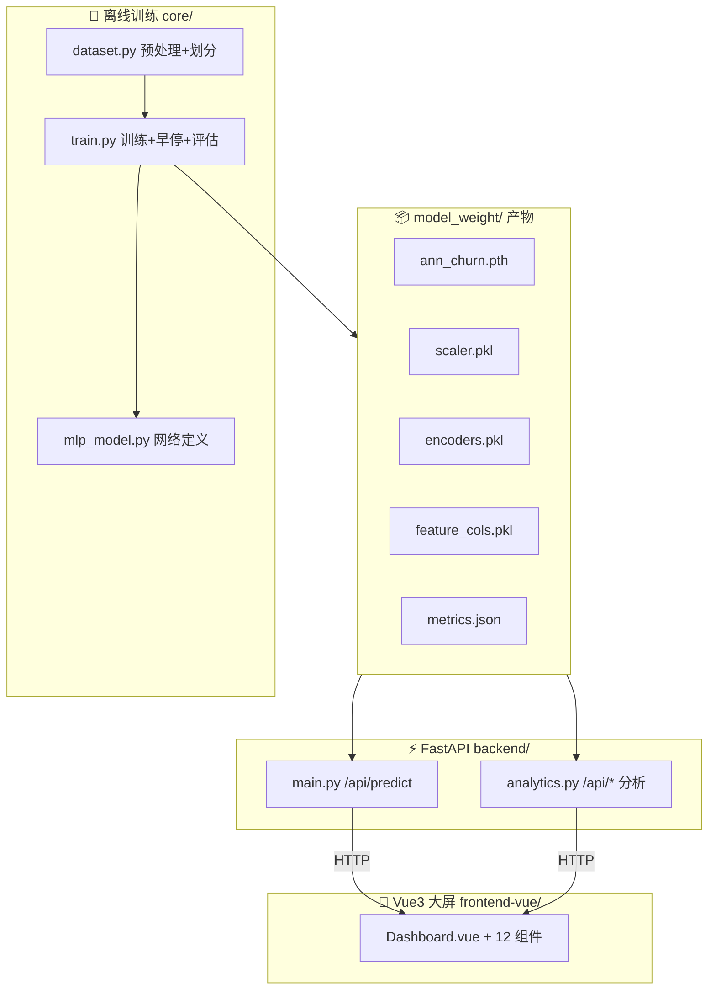

<p align="center">
  
</p>

<h1 align="center">🛒 电商用户流失预测 · 数据可视化大屏</h1>

<p align="center">
  基于 PyTorch ANN-MLP 的电商用户流失预测系统<br/>
  <b>PyTorch 训练 → FastAPI 实时推理 → Vue3 科技风大屏 → 规则化经营洞察</b>
</p>

<p align="center">
  
  
  
  
  
  
</p>

---

## ✨ 项目亮点

- 🧠 **ANN-MLP 流失预测**：`18 → 64 → 32 → 1`，BatchNorm + Dropout + 早停，准确率 **92.16%** / AUC **0.9154**
- 🔗 **训练/推理解耦**：产物 pkl/pth 统一持久化，后端只读文件、不 import 训练代码，换数据重训前后端零改动
- 🖥️ **科技风大数据大屏**：暗星空粒子背景 + 发光描边 + 流光扫边 + 中心呼吸光晕仪表盘（**ECharts 专业图表** + 科技暗色主题）
- 📊 **6 大数据面板**：核心指标 / 设备占比 / 年龄段流失率 / 渠道流失率 / 特征相关性 / 训练损失曲线
- 📈 **Loss 曲线**：训练实时持久化，大屏面板可视化 + 文档配图
- 💡 **规则化经营洞察**：自动生成「沉睡用户流失率 92.2%」等可执行建议，非硬编码

## 🚀 快速启动

```bash
# 1. 安装依赖（二选一）
uv venv --python 3.10.11 && uv pip install -e .    # 推荐
python -m pip install -r backend/requirements.txt   # 或

# 2. 训练模型（生成 model_weight/* 与 metrics.json）
python core/train.py

# 3. 启动后端（http://127.0.0.1:8000，Swagger: /docs）
python backend/main.py

# 4. 启动前端（http://localhost:5173）
cd frontend-vue && npm install && npm run dev
```

> **注意**：`data/`、`model_weight/`、`result_img/` 已 git 忽略，全新克隆后需先执行第 2 步训练。

## 📸 效果预览

### 数据可视化大屏


### 训练 / 验证 Loss 曲线


## 🧩 系统架构



## 🔌 后端接口

| 接口 | 方法 | 说明 |
|------|------|------|
| `/health` | GET | 健康检查 |
| `/api/predict` | POST | 18 特征 → 流失概率 + 风险等级 |
| `/api/dashboard` | GET | 大屏聚合数据（一次返回全部统计） |
| `/api/overview` | GET | 总体指标 |
| `/api/dimensions` | GET | 维度流失率 |
| `/api/correlations` | GET | 特征相关性 |
| `/api/insights` | GET | 规则化经营洞察 |
| `/api/model-metrics` | GET | 模型指标（acc/AUC/Loss） |

```bash
# 预测示例
curl -X POST http://localhost:8000/api/predict \
  -H "Content-Type: application/json" \
  -d '{"gender":"M","age_range":"55+","new_user":0,"register_days":30,"member_level":0,
       "device":"Mobile","operative_system":"Linux","source":"Social","total_pages_visited":5,
       "active_days_30d":1,"days_since_last_login":60,"cart_total":1,"fav_total":0,
       "last_buy_days":90,"buy_freq":1,"total_spend":150,"avg_order_amount":150,"refund_cnt":2}'
# → {"churn_prob":0.9329,"risk_level":"高流失风险","color":"red"}
```

## 📚 项目文档

| 文档 | 内容 |
|------|------|
| [📖 项目说明文档](docs/01-项目说明文档.md) | 项目是什么 / 特性 / 技术栈 / 效果 |
| [🏗️ 技术架构文档](docs/02-技术架构文档.md) | 解耦架构 / 模块设计 / 数据流 / API |
| [📊 数据分析报告](docs/03-数据分析报告.md) | 全维度 EDA + 分群洞察 |
| [🧠 模型设计文档](docs/04-模型设计文档.md) | 网络结构 / 超参 / 训练 / 评估 / 优化空间 |
| [🎨 大屏可视化设计文档](docs/05-大屏可视化设计文档.md) | 配色 / 布局 / 组件 / 动效 / 图表规范 |
| [🚀 部署与运维指南](docs/06-部署与运维指南.md) | 部署 / 生产化 / 常见问题 |
| [💼 面试要点与Q&A](docs/07-面试要点与Q&A.md) | 项目亮点 / 高频面试题 |
| [✍️ 博客：从零构建流失预测大屏](docs/blog/从零构建电商用户流失预测大屏.md) | 叙事式开发记录 |

## 📁 项目结构

```
ecom_churn_web/
├── core/            # 🧠 离线训练（dataset / mlp_model / train）
├── backend/         # ⚡ FastAPI 推理 + 分析（main / analytics）
├── frontend-vue/    # 🎨 Vue3 大屏（Dashboard + 12 组件）
├── data/            # 📊 原始数据集（git 忽略）
├── model_weight/    # 📦 训练产物（git 忽略）
├── result_img/      # 📈 实验图表（git 忽略）
├── docs/            # 📄 全部项目文档
└── README.md / pyproject.toml / .gitignore
```

## 📈 模型表现

| 指标 | 值 |
|------|-----|
| 准确率 Accuracy | **92.16%** |
| AUC | **0.9154** |
| 留存召回率 | 92.31% |
| 流失召回率 | 92.00% |
| 最佳轮次 | Epoch 42（早停于 57） |

**关键洞察**：沉睡用户（>30 天未下单）流失率 **92.2%**；55+ 年龄段流失率 **80%**；下单频次、消费金额、活跃度是强保护信号（|corr| > 0.6）。

## 📄 开源许可

本项目仅供学习演示。数据为模拟数据，模型指标不代表真实业务水平。
