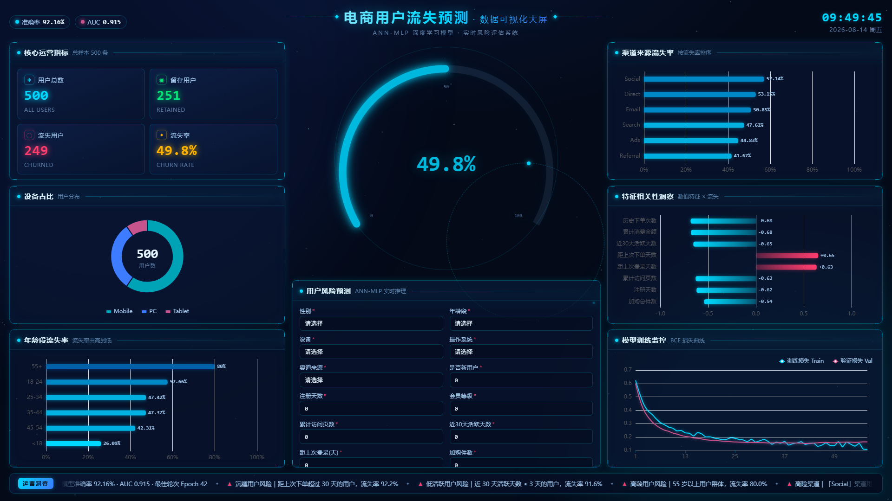
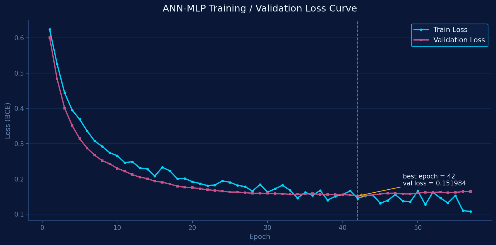

# 项目说明文档

> **电商用户流失预测 · 数据可视化大屏**
> 基于 PyTorch ANN-MLP 的电商用户流失预测系统，FastAPI 推理后端 + Vue3 科技风大数据大屏前端。

---

## 1. 这是什么项目？

电商平台最关心的问题之一：**哪些用户正在流失、什么时候流失、为什么流失**。

本项目给出了一个完整闭环的答案：

1. **离线建模**：基于 500 条电商用户样本，用 PyTorch 训练 ANN-MLP 神经网络，学习「用户行为 → 流失」的映射；
2. **在线推理**：FastAPI 提供 `/api/predict` 接口，输入 18 个用户特征，实时返回流失概率与风险等级；
3. **数据大屏**：Vue3 打造科技风大数据可视化大屏，把全量用户画像、维度流失率、特征相关性、模型训练过程可视化呈现；
4. **持续分析**：后端内置 8 个分析接口 + 规则化经营洞察，把「数据」翻译成「可执行的运营建议」。

## 2. 解决了什么问题？

| 业务痛点 | 本项目的解法 |
|---------|-------------|
| 流失是「事后」的，等发现已晚 | 基于行为特征**提前预警**流失概率 |
| 人工判断经验化、不统一 | 神经网络统一打分，结果可量化可复现 |
| 数据躺在 CSV 里没人看 | 大屏可视化 + 洞察文案自动生成 |
| 模型训练与线上推理脱节 | 训练产物(pkl/pth)统一持久化，推理只读文件，**训练与推理 100% 同源** |

## 3. 功能特性

### 🧠 模型能力
- ANN-MLP（64-32）二分类，Sigmoid 输出流失概率
- 完整预处理管线：LabelEncoder 编码 + StandardScaler 标准化 + 分层抽样（7:2:1）
- 早停（patience=15）+ Dropout(0.3) + BatchNorm + L2 正则
- 评估：准确率 **92.16%**、AUC **0.9154**、混淆矩阵、Loss 曲线

### ⚡ 推理能力
- 18 特征 → 流失概率 + 风险等级（低/中/高）+ 建议文案
- 非法分类值友好报错（400 + 合法值提示）
- Swagger 交互式接口文档

### 🖥️ 大屏能力
- 深色科技风：暗星空粒子背景 + 发光描边 + 流光扫边 + 呼吸光晕
- 六大可视化面板：核心指标 / 设备占比 / 年龄段流失率 / 渠道流失率 / 特征相关性 / 训练损失曲线
- 中心呼吸光晕仪表盘，实时预测联动
- 底部运营洞察跑马灯
- 「随机示例」一键填充演示数据

## 4. 技术栈

| 层 | 技术 |
|----|------|
| 前端 | Vue 3 + Vite 6 + SCSS + Axios + **ECharts 6**（科技暗色主题定制） |
| 后端 | Python 3.10 + FastAPI + Uvicorn + Pydantic v2 |
| AI | PyTorch 2.5 + scikit-learn + pandas + numpy + matplotlib |
| 工程 | uv 包管理、前后端分离、Vite 代理、CORS |

## 5. 快速开始

```bash
# 1. 安装依赖（二选一）
uv venv --python 3.10.11 && uv pip install -e .
# 或
python -m pip install -r backend/requirements.txt

# 2. 训练模型（生成 model_weight/* 与 metrics.json）
python core/train.py

# 3. 启动后端 http://localhost:8000 （Swagger: /docs）
python backend/main.py

# 4. 启动前端 http://localhost:5173
cd frontend-vue && npm install && npm run dev
```

## 6. 效果预览





## 7. 项目结构

```
ecom_churn_web/
├── core/            # 🧠 离线训练模块（dataset / mlp_model / train）
├── backend/         # ⚡ FastAPI 推理后端（main / analytics）
├── frontend-vue/    # 🎨 Vue3 大屏前端（Dashboard + 12 个组件）
├── data/            # 📊 原始数据集
├── model_weight/    # 📦 训练产物（pth / pkl / metrics.json，git 忽略）
├── result_img/      # 📈 实验图表（git 忽略）
├── docs/            # 📄 全部项目文档
└── README.md / pyproject.toml / .gitignore
```

## 8. 核心亮点（面试可以讲）

1. **训练推理解耦**：训练模块与 Web 后端通过文件产物(pkl/pth)交互，后端不 import 训练代码，换数据只需重训，前后端零改动；
2. **预处理同源**：scaler / encoders / feature_cols 训练时持久化，推理只读，杜绝「训练与推理预处理不一致」；
3. **大屏可视化**：从数据统计到经营洞察全链路，且洞察由规则自动生成，非硬编码；
4. **工程健壮性**：异常输入友好提示、CORS、Vite 代理、lifespan 生命周期、`weights_only` 安全加载。

## 9. 当前局限

- 数据为**模拟数据**（500 条），特征与标签相关性较强，模型指标高于真实业务常见水平；
- 仅本地演示，未实现登录鉴权与高并发；
- 模型为浅层 MLP，可对比 XGBoost/LightGBM 或引入时序特征进一步提优。

> 完整技术细节见 [02-技术架构文档](02-技术架构文档.md)、[04-模型设计文档](04-模型设计文档.md)。
