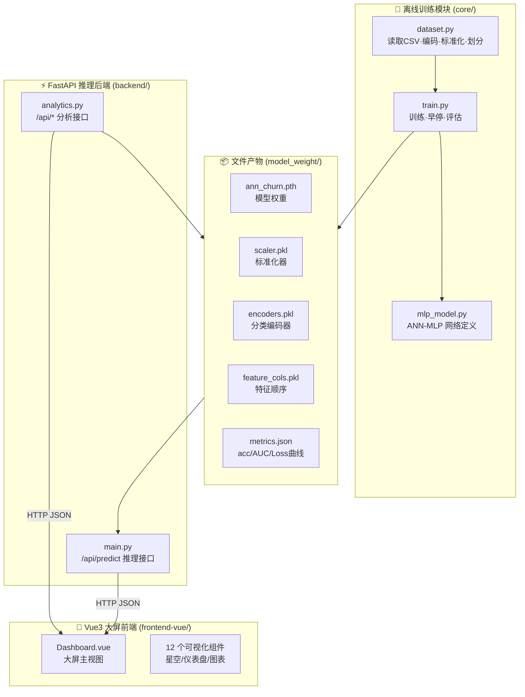

# 技术架构文档

> 本文档描述项目当前的真实架构：**训练 / 推理解耦** + **前后端分离** + **大屏数据分析**。

---

## 1. 总体架构

系统分三大模块，模块之间**不直接函数调用**，通过**文件产物**与 **HTTP 接口**交互：



**解耦关键点：**
- `core/` 训练完成产出文件即完成任务，后端**绝不 import train.py**；
- 后端只读 `model_weight/` 下的 pkl/pth，**不复写预处理代码**；
- 更换数据集 / 重新训练，只需重跑 `train.py`，后端与前端零改动。

## 2. 模块职责

### 2.1 core —— 离线训练模块（只做训练，不对外服务）

| 文件 | 职责 | 输入 → 输出 |
|------|------|-------------|
| `dataset.py` | 读 CSV、丢弃 user_id、LabelEncoder 编码 5 个分类列、StandardScaler 标准化、分层抽样 7:2:1、保存 pkl | `data/churn_data.csv` → 3 个 Dataset + 3 个 pkl |
| `mlp_model.py` | MLP 网络定义（18→64→32→1），训练与推理共用**同一个类** | 超参 → 模型实例 |
| `train.py` | 训练循环、早停、保存最优权重、绘制 Loss、测试集评估、输出 metrics.json | pkl 产物 → pth + loss_curve.png + metrics.json |

### 2.2 backend —— FastAPI 推理后端（只做推理 + 分析）

| 文件 | 职责 |
|------|------|
| `main.py` | 启动时(lifespan)加载模型产物；`/api/predict` 推理接口；风险分级；异常处理；CORS |
| `analytics.py` | 惰性加载 CSV 并缓存；统计总体指标、维度流失率、特征相关性；规则化生成经营洞察；读取 metrics.json |

### 2.3 frontend-vue —— Vue3 大屏前端

| 文件/目录 | 职责 |
|-----------|------|
| `src/views/Dashboard.vue` | 大屏主视图：三栏布局 + 数据获取 + 预测状态管理 |
| `src/components/` | 12 个组件：StarField / PanelBox / RiskGauge / DonutChart / HBars / DivergingBars / LossCurve / StatTile / PredictForm / Ticker / Clock 等 |
| `src/api/request.js` | Axios 封装 + 统一错误处理 |
| `vite.config.js` | `/api` 代理转发（不 rewrite）+ `@` 别名 |

## 3. 数据流

### 3.1 训练数据流

```
churn_data.csv
   │ pandas 读取
   ▼
丢弃 user_id → 分离 X/y（18 特征）→ feature_cols 记录顺序
   │
   ├── 5 个分类列 → LabelEncoder.fit_transform → encoders.pkl
   └── 数值列保留
   ▼
StandardScaler.fit(X_train) → scaler.pkl
   ▼
train_test_split 分层抽样 7:2:1 → (train/val/test) Dataset
   ▼
MLP 训练（BCELoss + Adam + 早停）→ ann_churn.pth + metrics.json + loss_curve.png
```

### 3.2 推理数据流

```
Vue 表单 (18 特征 JSON)
   │ axios POST /api/predict
   ▼
Pydantic UserData 校验
   │ 分类字段 LabelEncoder.transform（训练时相同的编码器）
   │ 数值字段保留
   ▼
按 feature_cols 顺序组装向量 → StandardScaler.transform
   ▼
model.eval() 前向传播 → Sigmoid 概率
   ▼
风险分级(0.3 / 0.7) → { churn_prob, risk_level, color }
   ▼
Vue 联动中心仪表盘 + 展示结果
```

## 4. API 设计

所有业务接口统一挂载 `/api/*` 前缀（前端 Vite 代理原样转发）。

| 方法 | 路径 | 说明 |
|------|------|------|
| GET | `/health` | 健康检查（模型是否加载） |
| POST | `/api/predict` | 18 特征 → 流失概率 + 风险等级 |
| GET | `/api/overview` | 总体指标（用户数/流失/留存/流失率） |
| GET | `/api/dimensions` | 5 个分类维度 × 各项流失率 |
| GET | `/api/correlations` | 13 个数值特征与流失相关性 |
| GET | `/api/insights` | 规则化经营洞察 |
| GET | `/api/model-metrics` | 模型训练指标（acc/AUC/Loss） |
| GET | `/api/dashboard` | 大屏聚合数据（一次返回全部） |

### `/api/predict` 示例

```bash
curl -X POST http://localhost:8000/api/predict \
  -H "Content-Type: application/json" \
  -d '{"gender":"F","age_range":"25-34","new_user":0,"register_days":600,
       "member_level":4,"device":"PC","operative_system":"Windows","source":"Search",
       "total_pages_visited":150,"active_days_30d":25,"days_since_last_login":1,
       "cart_total":20,"fav_total":12,"last_buy_days":2,"buy_freq":40,
       "total_spend":15000,"avg_order_amount":600,"refund_cnt":0}'
```

```json
{ "churn_prob": 0.0086, "risk_level": "低流失风险", "color": "green" }
```

## 5. 关键设计决策

| 决策 | 理由 |
|------|------|
| 训练与推理完全解耦 | 训练是重型离线任务，推理要求轻量低延迟；解耦后互不影响、可独立演进 |
| 预处理对象(pkl)训练时持久化 | 保证「训练用预处理」与「推理用预处理」**同一对象**，杜绝不一致 bug |
| feature_cols.pkl 固化特征顺序 | 编码后的特征向量顺序必须与训练一致，否则模型输出无意义 |
| 后端统一 `/api/*` 前缀 | 前后端路由语义清晰；Vite 代理原样转发、不 rewrite，避免路径改写歧义 |
| FastAPI lifespan 替代 on_event | `on_event` 已废弃；lifespan 是官方推荐的启动/关闭生命周期 |
| `torch.load(weights_only=True)` | PyTorch 安全加载，防止反序列化执行任意代码（官方安全建议） |
| ECharts + 科技暗色主题 | 大屏追求「标准专业观感」，ECharts 交互/动画/主题成熟；按需引入 + 独立分包控制体积 |

## 6. 技术选型理由

| 选择 | 备选 | 选择理由 |
|------|------|----------|
| PyTorch | sklearn / TF | 自定义网络灵活、教学与演示直观、生态成熟 |
| FastAPI | Flask / Django | 原生异步、Pydantic 校验、自动 Swagger，适合 AI 推理服务 |
| Vue3 + Vite | React / 传统模板 | 组合式 API 简洁、Vite 开发体验好、SCSS 原生支持 |
| 分层抽样 7:2:1 | 简单随机 | 类别均衡前提下保证测试集分布稳定，评估更可信 |

## 7. 目录结构（当前状态）

```
ecom_churn_web/
├── backend/
│   ├── main.py            # FastAPI：/api/predict + /api/* 分析接口
│   └── analytics.py       # 数据分析服务（惰性缓存）
├── core/
│   ├── dataset.py         # 预处理 + 划分 + 产物保存
│   ├── mlp_model.py       # MLP 网络
│   └── train.py           # 训练入口 + 指标持久化
├── frontend-vue/
│   ├── src/views/Dashboard.vue
│   ├── src/components/    # 12 个可视化组件
│   ├── src/api/request.js
│   └── vite.config.js
├── data/                  # churn_data.csv
├── model_weight/          # 训练产物（git 忽略）
├── result_img/            # 实验图表（git 忽略）
└── docs/                  # 本项目所有文档
```

> 模型设计细节见 [04-模型设计文档](04-模型设计文档.md)；大屏组件设计见 [05-大屏可视化设计文档](05-大屏可视化设计文档.md)。
